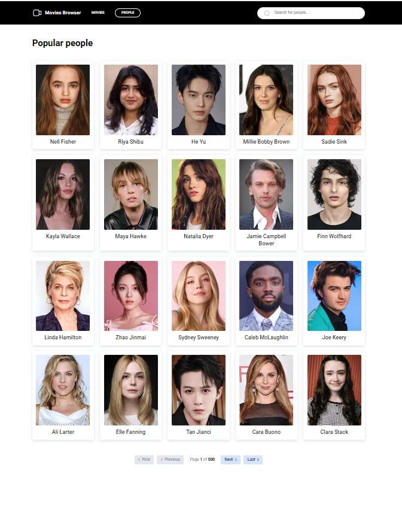
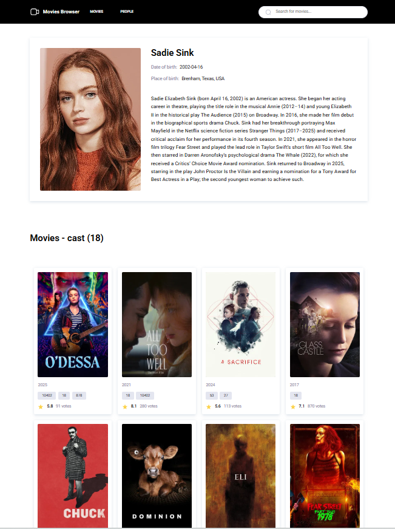

# 🎬 Movie Browser — Movie & People Search Engine

A modern, responsive web application designed to explore **The Movie Database (TMDB)**. This project provides a seamless experience for searching movies and actors, viewing production details, cast, and crew information.

### 🔗 [LIVE DEMO](https://karolina-kulpinska.github.io/deathly-hallows-project/#/movies)

---

## 📸 Interface Preview

  |  |
 
  |  |

## 🚀 Key Features

### 1. 🔍 Advanced Search Functionality
* **Intelligent Debouncing (500ms):** API calls are delayed while typing to optimize performance and reduce server load.
* **URL Synchronization:** The search query is synchronized with the URL hash, allowing users to share links to specific search results.
* **No Results Handling:** A dedicated "No Results" view with custom graphics is displayed when the database yields no matches.

### 2. 📑 Professional Pagination System
* **Full Navigation:** "First", "Previous", "Next", and "Last" page functionality.
* **API Protection:** Integrated logic to cap results at 500 pages, adhering to TMDB API technical constraints.
* **Mobile-First Design:** Pagination labels automatically hide on smaller screens, switching to intuitive SVG icons for better UX.

### 3. 🎥 Dynamic Content Rendering
* **Genre Mapping Engine:** Automatically transforms API genre IDs into human-readable text labels (e.g., Adventure, Drama, Crime).
* **Comprehensive Cast & Crew:** Detailed lists of everyone involved in a production, categorized by their specific roles.
* **Data Validation:** Advanced formatting for release dates (DD.MM.YYYY), vote counts, and average ratings (using `toFixed(1)`).

### 4. 🛠️ State & Error Management
* **Loading State:** A smooth, animated loading spinner ensures a positive user experience during data fetching.
* **Error State:** A robust "Ooops!" error page featuring a custom SVG icon and a "Back to Home" button, triggered by network issues or 404 responses.
* **Global Theming:** Project-wide consistency achieved through a unified `ThemeProvider` (colors, shadows, and breakpoints).

---

## 🛠️ Tech Stack

* **React 18** (Hooks, Router)
* **Redux Toolkit** (Centralized State Management)
* **Redux-Saga** (Handling complex asynchronous side effects)
* **Styled-Components** (Global styles, Theming, and Responsive Design)
* **Axios** (Robust API communication)

---

### 👨‍💻 Authors
Developed by a team of frontend enthusiasts as part of a comprehensive programming course.