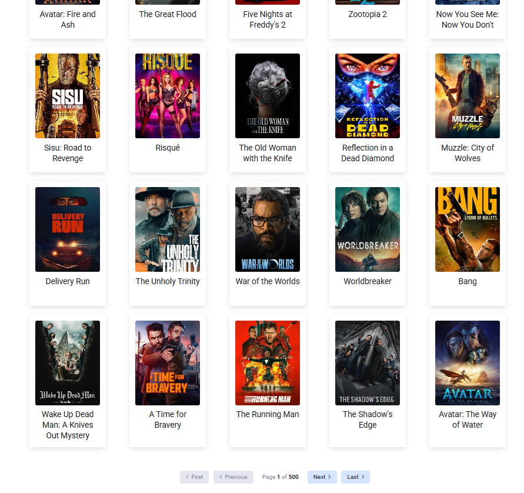

# 🚧 UNDER CONSTRUCTION: Movie Search Engine Prototype

Welcome to the **Movie Search Engine** project! Our team is actively developing a high-performance, responsive web application for exploring The Movie Database (TMDB).

### 🔗 Live Demo Site
The interface is being updated in real-time. You can track our progress here:
[**VIEW LIVE DEMO**](https://karolina-kulpinska.github.io/deathly-hallows-project/)

---

## 🖼️ Interface Preview

  
  
  

## 🏗️ Project Progress & Current Status

We are currently focusing on building a rock-solid logic engine and a seamless user experience.

### 1. 🧠 Core Logic & Optimization (Completed)
* **Intelligent Debouncing:** API calls are delayed by 500ms to reduce server load and improve user experience while typing.
* **State Management:** Powered by **Redux Toolkit** for predictable state and **Redux-Saga** for handling complex asynchronous flows.
* **Secure API Connection:** Stable integration with TMDB using Access Token V4 via Authorization headers.

### 2. 📑 Advanced Pagination System (Completed)
* Full navigation support: **First, Previous, Next, and Last** page buttons.
* **Safety Guard:** Implemented logic to cap results at 500 pages, preventing technical errors from the TMDB API.
* **Mobile Responsiveness:** Pagination labels automatically hide on small screens, displaying only intuitive SVG icons.
* **Grid Alignment:** Centered layout using `grid-column: 1 / -1` for a clean look.

### 3. 🎬 UI Components & Movie Tiles (Newly Updated)
* **Responsive Movie Tiles:** Implemented a flexible grid of movie cards with a vertical layout, optimized for both desktop and mobile devices.
* **Dynamic Rating System:** Integrated a star rating component with precise numerical formatting (`toFixed(1)`) and custom-styled SVG icons.
* **Global Theming:** Centralized all UI constants (colors like `candlelight`, `silver`, `woodsmoke`) and `box-shadow` styles within a unified `ThemeProvider` for project-wide consistency.
* **Navigation-Ready:** Movie tiles are wrapped in functional `Link` components, integrated with React Router for future detail-view transitions.

---

## 🔜 Next Steps
- [x] Implementation of the responsive Movie Title component.
- [x] Global theme configuration and style refactoring.
- [ ] Development of the Genre Tag system (mapping API genre IDs to names).
- [ ] Development of detailed Single Movie and Single Person pages.
- [ ] Performance optimization and accessibility (a11y) audit.

## 🛠️ Tech Stack
* **React 18** (Hooks, Router)
* **Redux Toolkit & Redux-Saga**
* **Styled-Components** (ThemeProvider)
* **Axios** (API communication)