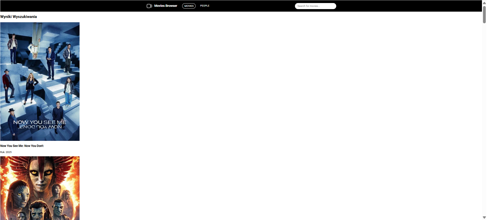

# 🚧 UNDER CONSTRUCTION: Movie Search Engine Prototype

Welcome to the **Movie Search Engine** project repository! Our team is actively developing a fast and robust front-end application designed for searching The Movie Database (TMDB). This README tracks our progress and key implemented features.

### 🔗 Live Demo Site (Coming Soon)

Our functional demo site will be available here as soon as the main UI components are complete. **We are currently in the process of implementing the visible front-end components.**

[**Live Demo Version**]( https://karolina-kulpinska.github.io/deathly-hallows-project/)

---

## 🏗️ Progress and Key Achievements

In the initial phase, we focused exclusively on building the **high-performance logic** and **state management foundation**—the "engine" that powers the search functionality.

### 1. 🧠 Search Optimization and Logic Control

* **Intelligent Throttling (Debouncing):** We implemented a **500ms Debounce delay** to ensure that the API is called only after the user stops typing. This significantly reduces server load and unnecessary API costs.
* **State Control:** We utilize **Redux Toolkit** for predictable state management and **Redux-Saga** for handling complex asynchronous flows (loading, error states, and API calls).

### 2. ✅ Stable TMDB API Connection

* **Authorization Fix:** We successfully refactored the code to use the secure **Access Token V4** via the `Authorization: Bearer` header, resolving previous 401 (Unauthorized) errors.
* **Verification:** The connection is stable and has been **verified** using Redux DevTools: upon dispatching a search query, movie data successfully fetches and populates the Redux store.

### 3. 🔜 Next Steps

With the search logic finalized and proven to work, our current focus shifts to the **User Interface (UI)** implementation:

* **Search Component:** Building the visible input field and connecting it to the underlying Redux logic.
* **Results View:** Displaying the fetched movie list to the user.

